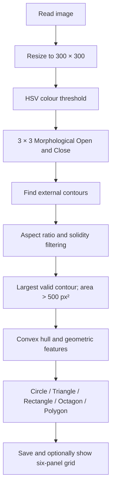
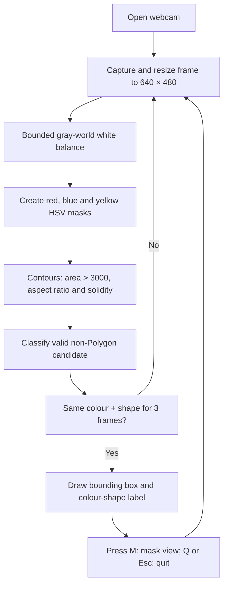

# Chapter 4.4 — Shape Detection of Traffic Signs

**Developed by:** Member 4 (Kendrew)
**Module:** OpenCV preliminary colour segmentation and shape detection

## 4.4.1 Purpose and Scope

This preliminary module detects the dominant sign-coloured region and classifies its geometric shape as Circle, Triangle, Rectangle, Octagon or Polygon. It is implemented in C++17 with OpenCV. The static program in `preliminary/member4_shape_detection/shape_detection.cpp` tests the supplied image folders and optionally displays a six-panel processing result with `--show`. The separate `camera_detection.cpp` program demonstrates live webcam colour-and-shape detection.

This module is not the final 49-class traffic-sign classifier. It provides explainable image-processing evidence and candidate/shape information. The final system will use a pretrained YOLO26s CNN detector to distinguish signs that have the same colour and shape but different pictograms or speed values.

## 4.4.2 Algorithm Description

1. The static program resizes the source image to 300 × 300 pixels.
2. It converts the BGR image to HSV and applies colour-specific thresholds for Red Signs, Blue Signs or Yellow Signs. Red uses two HSV hue ranges because hue wraps around the 0/180 boundary.
3. A 3 × 3 rectangular morphological opening removes small mask noise, followed by closing to fill small holes.
4. External contours are extracted from the HSV colour mask. Grayscale, Gaussian blur and Canny edges are generated only for the visual grid; they are not the contour source used for classification.
5. Each contour is filtered by bounding-box aspect ratio (0.5–1.5) and solidity. The yellow category has a lower solidity requirement (0.40) than red/blue (0.50). The largest remaining contour is accepted only when its area exceeds 500 px².
6. The selected contour is smoothed, converted to a convex hull and analysed using loose and strict `approxPolyDP` approximations, minimum-enclosing-circle area ratio and bounding-box extent.
7. Three loose vertices produce Triangle. Four loose vertices use extent < 0.70 to identify a triangle-like contour; otherwise they produce Rectangle. For other contours, a circle-fill ratio > 0.60 identifies a round shape; strict vertices 7–9 produce Octagon and other round contours produce Circle. The remainder is Polygon.
8. A 3 × 2 grid is saved: Original, Grayscale, Canny Edges, Colour Mask, Shape, and Sign Segmented.

## 4.4.3 Static Demonstration Flow — `shape_detection.cpp --show`



`--show` opens each saved six-panel grid and waits for a key press before continuing to the next image. This is the recommended static preliminary demonstration because it clearly shows the HSV mask and segmented sign.

## 4.4.4 Live Camera Demonstration — `camera_detection.cpp`



The webcam program has no `--camera` command-line flag: it is a separate executable/source file. For the presentation, build and run `camera_detection.cpp`; press **M** to show the useful 2 × 2 view (Original, HSV Mask, Contours and Final Output), and **Q** or **Esc** to quit. Do not claim that the live result recognises the exact traffic-sign class; it currently recognises colour and shape only.

## 4.4.5 Evaluation Methodology

The supplied input folders contain 84 images: 28 Red Signs, 28 Blue Signs and 28 Yellow Signs. The predicted output shape for each image was manually compared with the visible ground-truth sign shape. A result is correct only when the predicted geometric class matches the sign: Circle, Triangle, Rectangle/Diamond or Octagon.

```text
Shape-classification accuracy =
(Correct shape classifications / Total test images) × 100%
```

The program console labels its aggregate result as “Overall accuracy”; this report uses the manually checked result below. It is important to distinguish this geometric shape accuracy from the final YOLO 49-class recognition accuracy, which will be evaluated separately.

## 4.4.6 Results

The shape-detection module correctly classified 78 of the 84 supplied images. Six images produced an incorrect shape result. The measured shape-classification accuracy is therefore:

```text
(78 / 84) × 100% = 92.9%
```

| Colour category | Total images | Correct shapes | Incorrect shapes | Shape-classification accuracy |
|---|---:|---:|---:|---:|
| Red Signs | 28 | 25 | 3 | 89.3% |
| Blue Signs | 28 | 26 | 2 | 92.9% |
| Yellow Signs | 28 | 27 | 1 | 96.4% |
| **Overall** | **84** | **78** | **6** | **92.9%** |

The result is strong for a preliminary classical computer-vision method, but it is limited to geometric shape detection. A correct Circle, Triangle or Rectangle result does not identify the exact traffic-sign meaning. The six-panel grids saved in `preliminary/member4_shape_detection/output/` provide visual evidence of the mask, selected contour and final result.

## 4.4.7 Error Analysis

The six error grids were inspected. The failure cases show that the dominant cause is not Canny edge detection, because Canny is only displayed for visual explanation. The actual cause is an imperfect HSV mask: background pixels of a similar colour merge with the sign or the sign boundary becomes irregular. The distorted mask then changes the vertices, extent or circle-fill value used by `classifyShape()`.

| Category | File | Expected shape | Output shape | Verified reason |
|---|---|---|---|---|
| Red | `000_1_0002.png` | Circle | Octagon | The red ring is segmented as a slightly irregular rounded contour. The strict polygon approximation retains 7–9 vertices, so the circle is routed to the Octagon branch. |
| Red | `005_0030.png` | Circle | Polygon | Red background/signboard pixels connect to the circular ring in the HSV mask. The selected contour is no longer round, so it fails the circle-fill threshold. |
| Red | `017_1_0017.png` | Circle | Polygon | Pixelation and red-mask noise around the sign produce a rough contour. Its circle-fill value falls below 0.60 and it reaches the Polygon fallback. |
| Blue | `023_1_0005.png` | Circle | Polygon | Strong glare and low contrast leave an incomplete, deformed blue mask; the result does not preserve a stable circular boundary. |
| Blue | `027_0012.png` | Circle | Rectangle | Blue background/nearby pixels merge with the roundabout sign. The enlarged contour has four loose vertices and sufficient extent, so the rectangle branch is selected. |
| Yellow | `038_0008.png` | Triangle | Octagon | Yellow/green vegetation pixels attach to the triangular mask. The distorted contour does not simplify to three vertices; its strict approximation falls in the 7–9-vertex range, producing Octagon. |

### Error Patterns and Future Improvements

1. **Red circular signs:** Pixelation and neighbouring red objects can lower the circle-fill value or create an octagon-like polygon approximation. More contour smoothing or a modestly lower circularity threshold could recover some circles, but the threshold must be retested because it may increase false positives.
2. **Blue signs:** Glare, faded blue pixels and sky/background colours can cause incomplete masks or merge external regions with the sign. Adaptive HSV saturation/value thresholds, illumination normalisation and a colour-specific connected-component selection method could reduce this problem.
3. **Yellow warning signs:** Yellow vegetation/background pixels can join the mask and corrupt the triangle contour. A yellow-specific mask refinement, stronger separation of connected components, or a secondary `minAreaRect`/triangle-angle check could improve the result.

These improvements are proposed for future experimentation only. The current preliminary C++ code remains unchanged because the reported 92.9% result is based on its existing tuned parameters.

## 4.4.8 Parameters and Justification

| Parameter | Code value | Purpose |
|---|---:|---|
| Static output size | 300 × 300 | Consistent six-panel output |
| Gaussian blur | 5 × 5 | Smooth Canny visualisation only |
| Canny thresholds | 50, 150 | Edge visualisation only |
| Morphology kernel | 3 × 3 rectangle | Removes small mask noise and fills holes |
| Static aspect ratio | 0.5–1.5 | Rejects highly elongated blobs |
| Static solidity | 0.50 red/blue; 0.40 yellow | Retains solid sign-like masks while allowing yellow variation |
| Static contour area | > 500 px² | Rejects small regions |
| Loose polygon epsilon | 3.5% of perimeter | Triangle/rectangle decision |
| Strict polygon epsilon | 1% of perimeter | Octagon/circle distinction |
| Circle-fill threshold | > 0.60 | Identifies sufficiently round contours |
| Camera contour area | > 3000 px² | Reduces small live-video false detections |
| Camera stability | 3 frames | Reduces flickering labels |

## 4.4.9 Limitations and Final-System Link

HSV thresholding can produce noise or miss signs under glare, shadows, faded paint, motion blur, occlusion, perspective distortion or backgrounds with similar colours. The static program uses the largest valid contour, so it is not designed for multiple signs in one image. The camera program similarly selects the best valid candidate in each frame. These are expected limitations of a classical colour-and-shape approach.

The next phase is to collect and annotate sufficient images for all 49 target classes, apply realistic training-only augmentation, and fine-tune YOLO26s at a 640-pixel baseline. YOLO26s will provide final bounding-box detection and pictogram/class recognition, while the OpenCV results remain useful for preliminary validation and an explainable presentation. The trained model will be exported to OpenVINO for the Intel laptop/server deployment and compared with YOLO26n only if the measured latency or web concurrency is too high.
