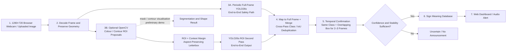
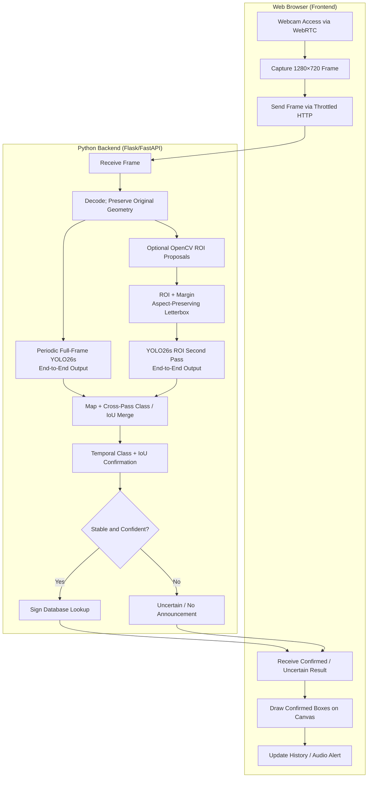

# Chapter 3 — Proposed Method and System Design

## 3.1 Design Specification

### 3.1.1 Proposed System

MYSignVoice is a server-side web-based Malaysian traffic-sign recognition system designed for real-time detection from live laptop-camera feeds or uploaded images/videos. Users access it through a desktop/laptop browser. There is no native Android or iOS application in the active scope. For laptop-camera operation, the preferred capture resolution is 1280×720 so that distant signs retain more source pixels. The Python backend (Flask or FastAPI) runs a trained YOLO26s model at a 640-pixel inference baseline, then returns bounding boxes, class labels and confidence scores to the browser.

The active Intel CPU deployment candidate is the validated OpenVINO export. YOLO26n is retained only as a latency fallback if YOLO26s misses the measured server gate; YOLO26m is a challenger only when a sufficiently large, balanced dataset and a GPU server are available. The old Android guide and ncnn conversion script remain archival references and are not part of implementation or acceptance testing.

The preliminary OpenCV work is retained as an important first stage and validation tool. It uses HSV colour segmentation for red, blue and yellow sign regions; 3 × 3 morphological opening and closing; contour extraction; aspect-ratio and solidity filtering; and geometric shape classification. The static program produces a six-panel result (original image, grayscale, Canny edges, HSV colour mask, classified shape and segmented sign). The live-camera program additionally uses limited gray-world white balance and a three-frame stability check. Canny edges are shown for explanation only; contours for classification are obtained from the HSV mask.

YOLO26s is the final CNN recognition component because colour and shape alone cannot distinguish signs with the same appearance, for example different speed-limit signs or different yellow warning symbols. Its standard pretrained detection architecture is fine-tuned without a custom backbone or attention module. YOLO26 uses its end-to-end, one-to-one head by default, so each detector pass is NMS-free. The deployment still uses periodic full-frame inference as a safety path. OpenCV colour/contour candidates may trigger an additional high-resolution crop inference, but they are never a mandatory gate. Full-frame and crop outputs are combined using application-level class/IoU deduplication before temporal confirmation; this cross-pass merge is not legacy detector NMS.

### 3.1.2 Methodology and Work Procedure

The project follows an iterative prototyping methodology:

1. **Preliminary image-processing validation.** Run the existing C++ program on the 84 supplied images and show the six-panel segmentation result. Run the separate webcam executable to demonstrate real-time colour and shape detection.
2. **Dataset preparation.** Define exactly 49 Malaysian traffic-sign classes. Collect multiple source photographs for every class, annotate each visible sign with a bounding box and class label, and split the dataset by original image into training, validation and test sets.
3. **Data augmentation.** Apply realistic training-only augmentation such as brightness/contrast change, small rotation, scale/translation, blur, noise and partial occlusion. Labels must be transformed together with the image. Augmented copies must not be placed across validation or test sets.
4. **YOLO26s training.** Fine-tune pretrained `yolo26s.pt` with Ultralytics on Google Colab. Start at `imgsz=640`, 150 epochs, batch size 16 where GPU memory permits, and early stopping. Keep YOLO26's default end-to-end head and standard losses for the controlled baseline.
5. **Evaluation and model choice.** Measure precision, recall, F1-score, mAP@0.5 and mAP@0.5:0.95 on the held-out test set. Improve data balance, labels and augmentation before model size. Use YOLO26n only if YOLO26s fails the latency gate; test YOLO26m only with adequate balanced data and a GPU server.
6. **Safe-hybrid server deployment.** Export the validated model to OpenVINO for an Intel CPU server, then compare its metrics with `best.pt`. The Flask/FastAPI backend accepts 1280×720 webcam frames or uploaded images/videos and performs periodic full-frame YOLO inference. An optional OpenCV branch proposes colour/contour ROIs; each crop retains aspect ratio, includes contextual margin and is letterboxed for a second pass. Current-frame outputs are mapped to full-frame coordinates and merged with class-aware IoU logic.
7. **Temporal filtering and benchmarking.** Confirm a detection only when the same class and approximately the same bounding box persist for 2–3 frames. Compare pure full-frame, ROI-only and safe-hybrid modes on identical laptop-camera recordings. Enable the ROI optimization only when measured end-to-end latency, recall and false-positive rate justify it.

### 3.1.3 Tools and Technologies

| Area | Proposed tool / technology | Purpose |
|---|---|---|
| Preliminary image processing | OpenCV 4, C++17 | HSV masks, morphology, contours, shape visualisation and webcam demonstration |
| Annotation and augmentation | Roboflow or equivalent YOLO-format annotation tool; project augmentation scripts | Bounding-box labels, dataset checks and training augmentation |
| Model training | Ultralytics YOLO26s, Python, Google Colab GPU | Transfer learning at 640, validation and controlled model comparison |
| Web backend | Python and FastAPI | Load OpenVINO once and serve in-memory frame/image inference |
| Web frontend | HTML, CSS, JavaScript | Camera access via WebRTC, display bounding boxes, class labels and confidence |
| Real-time communication | Throttled HTTP POST | Send the next compressed webcam frame only after the previous request completes |
| Deployment optimization | OpenVINO on Intel CPU; YOLO26 end-to-end output; cross-pass IoU merge and temporal matching; optional OpenCV ROI proposals | Preserve geometry, avoid detector NMS overhead, merge full/crop outputs and reduce one-frame noise |
| Development environment | VS Code, Python 3.10+ | Backend development and testing |
| Preliminary C++ work | Microsoft Visual Studio 2022, OpenCV 4 | Build and run the preliminary shape detection programs |

### 3.1.4 User Requirements

The system shall:

- detect and recognise 49 defined Malaysian traffic-sign classes from a live webcam stream or uploaded image/video through a web browser;
- draw bounding boxes with class name and confidence score on the detected signs;
- support both real-time webcam detection and static image/video upload for batch processing;
- display a detection history log showing recent detections with timestamps and confidence scores;
- work through Chrome, Firefox or Edge on the target desktop/laptop without requiring a native mobile application;
- provide a clear preliminary demonstration of OpenCV segmentation and live colour/shape detection;
- allow users to adjust the confidence threshold through the web interface;
- preserve camera-frame and ROI aspect ratio during YOLO preparation;
- periodically run full-frame YOLO even when optional ROI focusing is active;
- require class and bounding-box consistency across consecutive frames before announcing a sign; and
- return an uncertain/no-announcement outcome when evidence is weak, rather than forcing a fallback class.

### 3.1.5 Dataset Requirement and Feasibility

The 84 supplied images are suitable for demonstrating the OpenCV preliminary method, but they are **not sufficient to train a reliable 63-class YOLO detector**. Augmentation creates useful variation but cannot replace different real images, backgrounds, distances and lighting conditions. The canonical zero-based class IDs and hyphenated names remain frozen in `dataset/data.yaml`; corrected class ID 32 is `pass-obstacle-on-either-side` and the approved Malaysian-road-sign expansion occupies IDs 47–62.

For the final model, the minimum target is at least **50 original labelled images per class** (about 2,450 images), with a higher target of 100 or more images per class when possible. Each class should appear at close, medium and distant scales and under varied backgrounds, angles, illumination, blur and partial obstruction. The dataset should include laptop-camera images and background-only hard negatives such as red vehicles, blue information boards, yellow vegetation, lamps and coloured clothing. Video frames must be split by recording session rather than placing adjacent frames across train and test sets. Training augmentation may increase the number of training examples, but validation and test images must remain original, unseen images. If this collection target cannot be achieved, the team should reduce the final class scope and state the revised scope honestly.

### 3.1.6 System Performance Definition

The following are project performance targets, not guaranteed results:

| Measure | Definition | Target |
|---|---|---:|
| Preliminary segmentation detection rate | Images producing a valid non-Polygon OpenCV shape result / 84 supplied images | Report measured result separately; current code result is a preliminary baseline |
| YOLO precision and recall | Detection correctness and coverage on the held-out test set | ≥ 0.80 each, subject to sufficient balanced data |
| mAP@0.5 | Mean average precision at IoU 0.5 over 63 classes | ≥ 0.75, subject to sufficient balanced data |
| Web responsiveness | Time from frame submission to annotated result returned | < 200ms per frame on a machine with a modern GPU; < 500ms on CPU |
| Temporal confirmation | A displayed/announced detection matches the same class and an overlapping box across consecutive frames | 2–3 frames, tuned on validation videos |
| Hybrid acceptance gate | Safe hybrid compared with pure full-frame YOLO on identical laptop recordings | Adopt ROI optimization only if it improves the selected latency/recall/false-positive trade-off |
| Browser compatibility | Server-side system accessible from the target computer | Chrome, Firefox and Edge on desktop/laptop; no native mobile app |
| OpenVINO parity | Intel CPU export compared with its source `best.pt` on the identical test split | No more than 0.01 absolute mAP@0.5 loss |

### 3.1.7 Verification Plan

| Test level | Verification activity | Evidence |
|---|---|---|
| OpenCV unit / preliminary test | Run the unchanged shape-detection program across the 84 images; inspect saved six-panel grids and console summary | Detection-rate table, selected screenshots and list of failure cases |
| Webcam demonstration | Present a red, blue and yellow sign to the live camera; demonstrate mask view and stable label | Presentation screenshots/video and observed behaviour |
| Dataset verification | Check each image has a matching YOLO label, valid normalised coordinates, no empty class, and no original-image leakage between splits | Dataset audit table and class-distribution chart |
| YOLO model verification | Evaluate YOLO26s `best.pt` and its OpenVINO export on the same held-out test set | Precision, recall, mAP, per-class results, export parity and sample true/false detections |
| Web integration test | Test webcam streaming, image/video upload, inference response, bounding box display and detection log | Functional-test checklist on Chrome, Firefox and Edge |
| Performance test | Measure end-to-end latency from frame capture to result display | Latency measurements and FPS report |
| Mode benchmark | Run pure full-frame YOLO, ROI-only YOLO and safe hybrid on the same saved 1280×720 laptop-camera videos and thresholds | Per-mode latency/FPS, recall, missed-sign count and false positives per minute |
| Noise/uncertainty test | Use no-sign and hard-negative videos; inject low-confidence and inconsistent detections | Evidence that one-frame candidates are suppressed and no forced fallback class is announced |

## 3.2 System Design and Overview

### 3.2.1 Overall Block Diagram

The pipeline is a safe hybrid. Periodic full-frame YOLO26s is the authoritative safety path and cannot be disabled merely because OpenCV finds no candidate. Each YOLO26 pass uses the default end-to-end, NMS-free output. The optional OpenCV path gives the same detector a second, larger view of likely small signs. Crops include context and retain their aspect ratio. Both branches are converted to full-frame coordinates and combined by cross-pass class/IoU deduplication. A sign is displayed or announced only after class and box-overlap consistency across frames; weak evidence produces an uncertain/no-announcement state instead of a forced fallback class.

This design can improve small-sign recall and reduce flicker or isolated false positives, while ROI inference may improve speed on some hardware. None of those gains is guaranteed: ROI preprocessing and additional crop inferences also cost time. Pure full-frame, ROI-only and safe-hybrid modes must therefore be benchmarked on the target laptop before the optional ROI branch is accepted as an optimization.

### 3.2.2 Description of Overall Blocks

| Block | Description |
|---|---|
| 1. Browser Webcam / Uploaded Image | Captures a preferably 1280×720 RGB road-scene frame from the browser's webcam via WebRTC, or accepts an uploaded image/video file. |
| 2. Frame Preparation | Decodes the frame and preserves its geometry. The original full frame or an unwarped ROI is given to Ultralytics, which performs aspect-preserving letterboxing for the configured inference size. |
| 3A. Periodic Full-Frame YOLO26s | Runs the 640-baseline CNN detector with its default end-to-end output on a configurable schedule. A tracker may bridge intervening frames, but stale boxes are not reused without position updates. |
| 3B. Optional OpenCV ROI + YOLO Second Pass | HSV masks, morphology and contours propose candidates. Each ROI receives context margin and is passed to the same YOLO26s detector; a missing mask does not block the full-frame branch. |
| 4. Coordinate Mapping and Cross-Pass Merge | Maps crop detections back to full-frame coordinates and removes duplicates between detector passes using class, confidence and IoU evidence. This is application merging, not detector NMS. |
| 5. Temporal Confirmation | Accepts a result only when the same class and approximately the same bounding box persist for 2–3 frames. Low-confidence or inconsistent candidates become uncertain and are not announced. |
| 6. Sign Meaning Database | Maps the YOLO class ID to the Malaysian sign name, description and alert category. Stored as a JSON file on the server. |
| 7. Web Dashboard / Audio Output | Draws confirmed bounding boxes with class labels and confidence scores, records confirmed detections, and announces a sign without repeatedly speaking it on every frame. |

### 3.2.3 OpenCV Image-Processing Subsystem

```mermaid
flowchart LR
    A["BGR Camera Frame / Image"] --> B["Convert BGR to HSV"]
    B --> C["Colour-specific Thresholds\nRed, Blue or Yellow"]
    C --> D["3 × 3 Morphological Open and Close"]
    D --> E["External Contours"]
    E --> F["Aspect Ratio and Solidity Filters"]
    F --> G["Largest Valid Contour"]
    G --> H["Shape Features and Classification"]
    H --> I["Colour Mask, Segmented Sign and Shape Label"]
```

For static-image mode, the input is resized to 300 × 300, while grayscale conversion, Gaussian blur and Canny edge detection are included only in the six-panel visual output. The classification path uses the cleaned HSV mask. A contour is selected only when it has approximately sign-like proportions, sufficient solidity and an area above 500 px². Shape features include convex hull, minimum-enclosing-circle area ratio, loose and strict polygon approximations, and bounding-box extent. The output shape is Circle, Triangle, Rectangle, Octagon or Polygon.

For the separate live-camera preliminary program, frames are resized to 640 × 480, corrected using bounded gray-world white balance, and processed for all three colours. Candidates require area above 3000 px², valid aspect ratio and solidity. A label is only drawn after the same colour and shape persist for three frames. This makes the live output less unstable, although false masks can still occur in a complex scene.

In final deployment, OpenCV candidate generation is optional and may return multiple ROIs rather than only the largest contour. Each ROI must include surrounding context and remain unwarped. The HSV result is auxiliary evidence: it may request a second YOLO view, but it may not assign one of the 49 final classes or prevent the periodic full-frame YOLO path from running.

### 3.2.4 YOLO Training and Deployment Subsystem

```mermaid
flowchart LR
    A["Collect 64-Class Originals\nLaptop Camera + Hard Negatives"] --> B["Annotate Bounding Boxes\nYOLO Format"]
    B --> C["Split by Source / Recording Session\nTrain / Validation / Test"]
    C --> D["Training-only Camera Augmentation\nLight, Blur, Noise, Compression, Perspective"]
    D --> E["Fine-tune Pretrained YOLO26s at 640\nGoogle Colab"]
    E --> F["Evaluate: Precision, Recall, mAP\nConfusion Matrix"]
    F --> G["Export + Validate OpenVINO\nIntel CPU Server"]
    G --> H["Benchmark Full-Frame / ROI-Only / Safe Hybrid"]
    H --> I["Web Browser Real-time Inference"]
```

The class list must be frozen before annotation so the numeric class order in `dataset/data.yaml`, YOLO labels and the web sign database remains identical. Data quality and class balance are more important than increasing the number of augmented copies. Training data should include laptop-camera captures, small and distant signs, realistic light/blur/noise/compression, and no-sign hard negatives. Horizontal and vertical flips are excluded because they can reverse sign meaning or create impossible orientations.

The baseline fine-tunes standard pretrained YOLO26s at `imgsz=640` without a custom backbone, attention layer or detection head. Its default one-to-one inference/export path is end-to-end and NMS-free. On the target Intel CPU server, the OpenVINO export is accepted only after metric-parity and latency tests against `best.pt`. YOLO26n is used only if YOLO26s misses the latency gate while YOLO26n still passes the minimum quality gates. YOLO26m is tested only with adequate balanced original data and a GPU server, and must show a measured quality improvement without breaking latency or false-positive limits.

### 3.2.5 Web Application Architecture

The desktop/laptop web frontend captures preferably 1280×720 webcam frames using the browser's `getUserMedia` API and sends one compressed frame at a time to the Python backend through HTTP POST. The next request starts only after the previous request finishes, preventing a frame backlog on the CPU. The backend loads the validated YOLO26s OpenVINO model once at startup. Frames retain their aspect ratio and are letterboxed internally to the 640 baseline. Full-frame inference is the active mode; the optional ROI branch remains disabled unless later camera benchmarks satisfy its acceptance gates. Current detections are displayed immediately, while history and speech require the same class in two consecutive processed frames.

### 3.2.6 Relationship Between Preliminary Work and Final System

The preliminary work successfully demonstrates the classical image-processing concepts required by the project: colour segmentation, noise reduction, contour detection, geometric filtering and real-time visualisation. It should be presented as a preliminary candidate/shape-detection method, not as a 63-class recogniser. The final system adds the YOLO26s CNN to recognise the sign pictogram and distinguish classes that share the same colour and shape. OpenCV remains useful for explanation and optional ROI proposals, while periodic full-frame YOLO preserves a recovery path. This is a logical and defensible progression from traditional computer vision to deep-learning recognition.

### 3.2.7 Deployment Benchmark and Acceptance Gates

The final mode is selected from measurements rather than from an assumption that cropping is always faster. The same saved 1280×720 laptop-camera videos, model weights, confidence threshold and computer are used for all three modes:

| Mode | Purpose | Main risk |
|---|---|---|
| Pure full-frame YOLO | Establish the simplest latency, recall and false-positive baseline | Small distant signs may occupy few pixels; every scan processes the whole scene |
| ROI-only YOLO | Measure the maximum potential benefit of strict region focusing | Any OpenCV miss becomes an unrecoverable detector miss |
| Safe hybrid | Combine periodic full-frame recovery with optional high-resolution ROI evidence and temporal confirmation | Extra ROI preprocessing/inference may reduce FPS if too many candidates are proposed |

Record end-to-end median and 95th-percentile latency, processed FPS, sign-level recall, missed signs, false positives per minute and unstable label changes. At 640, YOLO26s is accepted when precision and recall are each at least 0.80, mAP@0.5 is at least 0.75, and target-server p95 latency is at most 500 ms on Intel CPU or 200 ms on the selected GPU server. The OpenVINO export may lose no more than 0.01 absolute mAP@0.5 against `best.pt`.

The safe hybrid is enabled only if, against full-frame YOLO26s on identical recordings, it improves p95 latency by at least 10% or small-sign recall by at least 0.02 absolute, while reducing no overall recall by more than 0.01 and not increasing false positives per minute. Candidate-count limits, full-frame interval, confidence threshold, cross-pass merge IoU and temporal window are tuned on validation videos and frozen before final testing.

The implemented laptop prototype is `preliminary/member4_shape_detection/webcam_yolo_demo.py`; pass the newly trained 63-class weights with `--model`. The repeatable detector-stage comparison is `preliminary/member4_shape_detection/benchmark_pipeline_modes.py`. It writes JSON and CSV for all three modes, computes class-aware precision/recall/F1 when YOLO labels are supplied, and reports false detections per input minute when a known no-sign source is supplied. Its raw metrics are calculated before the webcam demo's temporal confirmation so that filtering cannot hide one-frame detector errors.
