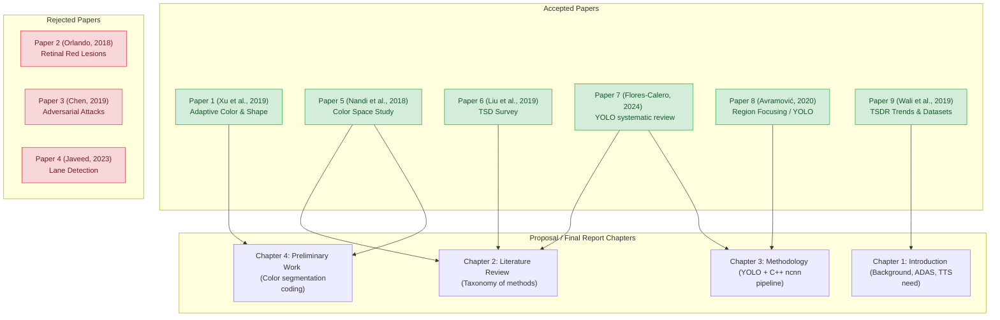

# UCCC2513 Mini Project — Literature Review Paper Analysis

## 🎯 Project Context & Goal
The project **"MYSignVoice: Intelligent Malaysian Traffic Sign Recognition for Visually Impaired Pedestrians Using Real-Time Camera Detection on Android"** aims to develop a mobile application that:
1. Captures live camera frames on Android (CameraX).
2. Performs real-time traffic sign detection and classification using **YOLOv8-nano** and **ncnn** compiled in **C++** with **OpenCV**.
3. Speaks out the detected signs and their meanings to visually impaired pedestrians via **Text-to-Speech (TTS)** and provides tactile feedback via **vibration**.

For **Member 1 (Android & UI Lead)**, the main focus is **color-based segmentation** (specifically red sign segmentation in Chapter 4) and developing the front-end user experience. The papers analysed below were uploaded by Member 1 to support the literature review and preliminary work.

---

## 📊 Summary of Paper Evaluations

Out of the **9 papers** uploaded to [literature_review_paper](file:///c:/Users/B2B/Desktop/miniproject/literature_review_paper), **6 papers are highly relevant** and are selected to construct our literature review and methodology, while **3 papers are irrelevant** and are rejected.

| File Name | Paper Title | Paper Type | Status | Primary Focus |
|---|---|---|---|---|
| [Paper 1](file:///c:/Users/B2B/Desktop/miniproject/literature_review_paper/1-s2.0-S0167739X18311804-main.pdf) | *Smart data driven traffic sign detection method based on adaptive color threshold and shape symmetry* | **Research Paper** | **✅ CAN BE USED** | Adaptive color segmentation & shape symmetry (Traditional CV) |
| [Paper 2](file:///c:/Users/B2B/Desktop/miniproject/literature_review_paper/1-s2.0-S0169260717307897-main.pdf) | *An ensemble deep learning based approach for red lesion detection in fundus images* | **Research Paper** | **❌ CANNOT BE USED** | Medical imaging (diabetic retinopathy red lesions) |
| [Paper 3](file:///c:/Users/B2B/Desktop/miniproject/literature_review_paper/978-3-030-10925-7_4.pdf) | *ShapeShifter: Robust Physical Adversarial Attack on Faster R-CNN Object Detector* | **Research Paper** | **❌ CANNOT BE USED** | Adversarial machine learning attacks on Stop signs |
| [Paper 4](file:///c:/Users/B2B/Desktop/miniproject/literature_review_paper/electronics-12-01079-v3.pdf) | *Lane Line Detection and Object Scene Segmentation Using Otsu Thresholding and the Fast Hough Transform for Intelligent Vehicles in Complex Road Conditions* | **Research Paper** | **❌ CANNOT BE USED** | Lane detection & road boundary segmentation |
| [Paper 5](file:///c:/Users/B2B/Desktop/miniproject/literature_review_paper/IJMECS_V10_N6_5.pdf) | *Traffic Sign Detection based on Color Segmentation of Obscure Image Candidates: A Comprehensive Study* | **Review / Survey Paper** | **✅ CAN BE USED** | Color space analysis and thresholding for TSDR |
| [Paper 6](file:///c:/Users/B2B/Desktop/miniproject/literature_review_paper/Machine_Vision_Based_Traffic_Sign_Detection_Methods_Review_Analyses_and_Perspectives.pdf) | *Machine Vision Based Traffic Sign Detection Methods: Review, Analyses and Perspectives* | **Review Paper** | **✅ CAN BE USED** | Taxonomy of TSD methods (Color, Shape, ML, LIDAR) |
| [Paper 7](file:///c:/Users/B2B/Desktop/miniproject/literature_review_paper/mathematics-12-00297-v2.pdf) | *Traffic Sign Detection and Recognition Using YOLO Object Detection Algorithm: A Systematic Review* | **Review Paper (Systematic Review)** | **✅ CAN BE USED** | YOLO algorithms in TSDR (SLR 2016-2022) |
| [Paper 8](file:///c:/Users/B2B/Desktop/miniproject/literature_review_paper/Neural-Network-Based_Traffic_Sign_Detection_and_Recognition_in_High-Definition_Images_Using_Region_Focusing_and_Parallelization.pdf) | *Neural-Network-Based Traffic Sign Detection and Recognition in High-Definition Images Using Region Focusing and Parallelization* | **Research Paper** | **✅ CAN BE USED** | YOLO optimization & region of interest (ROI) parallelization |
| [Paper 9](file:///c:/Users/B2B/Desktop/miniproject/literature_review_paper/sensors-19-02093.pdf) | *Vision-Based Traffic Sign Detection and Recognition Systems: Current Trends and Challenges* | **Review Paper** | **✅ CAN BE USED** | Comprehensive review of TSDR trends, datasets, and challenges |

---

## 🔍 Detailed Paper Analyses

### 1. Papers That CAN Be Used

---

#### 📄 Paper 1: Smart data driven traffic sign detection method based on adaptive color threshold and shape symmetry
* **File**: `1-s2.0-S0167739X18311804-main.pdf`
* **Authors**: Xianghua Xu, Jiancheng Jin, Shanqing Zhang, Lingjun Zhang, Shiliang Pu, Zongmao Chen
* **Journal / Year**: *Future Generation Computer Systems* (Elsevier), 2019
* **Paper Type**: **Research Paper**
* **IEEE Reference**: X. Xu, J. Jin, S. Zhang, L. Zhang, S. Pu, and Z. Chen, "Smart data driven traffic sign detection method based on adaptive color threshold and shape symmetry," *Future Generation Computer Systems*, vol. 94, pp. 381–391, May 2019, doi: 10.1016/j.future.2018.11.027.
* **Relevance for Member 1 (Color Focus)**: **Extremely High**
* **Technical Contribution**:
  * Proposes an **adaptive color threshold segmentation** method based on the cumulative distribution function (CDF) of the image histogram.
  * Introduces an approximate maximum and minimum normalization technique to suppress background noise and highlight brightness areas.
  * Combines this with a statistical hypothesis testing method for shape symmetry to extract Regions of Interest (ROIs).
* **Alignment with the Plan**:
  * Member 1 is assigned to color-based segmentation (red signs) in Chapter 4 and Chapter 2. This paper directly addresses the biggest flaw of standard HSV thresholding: sensitivity to illumination changes.
  * The adaptive thresholding algorithm using CDF provides a strong mathematical backing that Member 1 can reference in Chapter 2 (Literature Review) and Chapter 3 (Proposed Method) to design a more robust baseline thresholding module for the preliminary demo.
* **Why I choose this paper**: I choose this paper because it directly provides a concrete, peer-reviewed mathematical solution (approximate max-min normalization and CDF histograms) to solve the major limitation of traditional static color thresholding (varying illumination and weather). Citing this demonstrates to the teacher that our preliminary C++ color segmentation work (Chapter 4) uses robust, academically validated techniques rather than simple static color filters.

---

#### 📄 Paper 5: Traffic Sign Detection based on Color Segmentation of Obscure Image Candidates: A Comprehensive Study
* **File**: `IJMECS_V10_N6_5.pdf`
* **Authors**: Dip Nandi, A.F.M. Saifuddin Saif, Prottoy Paul, Kazi Md. Zubair, Seemanta Ahmed Shubho
* **Journal / Year**: *International Journal of Modern Education and Computer Science (IJMECS)*, 2018
* **Paper Type**: **Review / Survey Paper**
* **IEEE Reference**: D. Nandi, A. F. M. S. Saif, P. Paul, K. M. Zubair, and S. A. Shubho, "Traffic Sign Detection based on Color Segmentation of Obscure Image Candidates: A Comprehensive Study," *International Journal of Modern Education and Computer Science (IJMECS)*, vol. 10, no. 6, pp. 35–46, Jun. 2018, doi: 10.5815/ijmecs.2018.06.05.
* **Relevance for Member 1 (Color Focus)**: **Extremely High**
* **Technical Contribution**:
  * Focuses heavily on the **selection of proper color spaces** (RGB, HSV, HSI, YCbCr, CIELAB) for extracting color information from traffic signs.
  * Evaluates how robust these color spaces are when subjected to uncontrolled environmental conditions (e.g., fog, low lighting, occlusions).
  * Discusses classifier and template matching techniques used to verify candidate regions.
* **Alignment with the Plan**:
  * This paper is a perfect fit for Member 1’s section of Chapter 2 (Literature Review) which requires comparing color-based segmentation techniques.
  * It provides the exact theoretical justification for why we choose **HSV/HSI** over RGB: because HSV separates chromaticity (Hue and Saturation) from luminance (Value), allowing the detection to remain robust under varying outdoor sun conditions.
* **Why I choose this paper**: I choose this paper because it presents a comprehensive comparison of multiple color spaces. It provides the exact comparative tables, references, and mathematical reasoning I need to justify to the teacher why our project converts RGB camera frames to the HSV color space for the segmentation of red, blue, and yellow traffic signs.

---

#### 📄 Paper 6: Machine Vision Based Traffic Sign Detection Methods: Review, Analyses and Perspectives
* **File**: `Machine_Vision_Based_Traffic_Sign_Detection_Methods_Review_Analyses_and_Perspectives.pdf`
* **Authors**: Chunsheng Liu, Shuang Li, Faliang Chang, Yinhai Wang
* **Journal / Year**: *IEEE Access*, 2019
* **Paper Type**: **Review Paper**
* **IEEE Reference**: C. Liu, S. Li, F. Chang, and Y. Wang, "Machine Vision Based Traffic Sign Detection Methods: Review, Analyses and Perspectives," *IEEE Access*, vol. 7, pp. 86657–86675, Jul. 2019, doi: 10.1109/ACCESS.2019.2924947.
* **Relevance for Member 1 (Color Focus)**: **High** (Useful for the entire team)
* **Technical Contribution**:
  * Provides a comprehensive categorization of Traffic Sign Detection (TSD) algorithms into five major categories:
    1. Color-based methods
    2. Shape-based methods
    3. Color-and-shape-based hybrid methods
    4. Machine-learning-based methods
    5. LIDAR-based methods
  * Discusses color translation equations (RGB → HSV, HSI, CIELAB) and color index equations (e.g., $f = 2R - G - B$ for red signs, $f = R + G - 2B$ for yellow signs).
* **Alignment with the Plan**:
  * This paper serves as the primary structural template for our entire Chapter 2.
  * For Member 1, the detailed discussion on color translation and color index equations can be cited when explaining how they implement red sign segmentation.
  * For Members 2 and 4, the shape-based and machine-learning-based analysis is highly relevant.
* **Why I choose this paper**: I choose this highly cited IEEE Access review paper because it offers a clear and structured taxonomy dividing traditional methods from learning-based approaches. This gives the teacher a clear overview of the existing landscape in Chapter 2, showing that our project transition from color-based segmentation (traditional) to YOLO (deep learning) is historically and technically sound.

---

#### 📄 Paper 7: Traffic Sign Detection and Recognition Using YOLO Object Detection Algorithm: A Systematic Review
* **File**: `mathematics-12-00297-v2.pdf`
* **Authors**: Marco Flores-Calero, César A. Astudillo, Diego Guevara, Jessica Maza, Bryan S. Lita, Bryan Defaz, Juan Ante, David Zabala-Blanco, José M. Armingol Moreno
* **Journal / Year**: *Mathematics* (MDPI), 2024
* **Paper Type**: **Review Paper (Systematic Review)**
* **IEEE Reference**: M. Flores-Calero et al., "Traffic Sign Detection and Recognition Using YOLO Object Detection Algorithm: A Systematic Review," *Mathematics*, vol. 12, no. 2, p. 297, Jan. 2024, doi: 10.3390/math12020297.
* **Relevance for Member 1 (Color Focus)**: **Medium** (Extremely High for the overall project)
* **Technical Contribution**:
  * A Systematic Literature Review (SLR) covering 115 primary studies from 2016 to 2022 on YOLO applied to traffic sign detection and recognition.
  * Analyzes YOLO versions (YOLOv2 to YOLOv7/v8), public datasets (GTSDB, GTSRB, TT100K), evaluation metrics (mAP, FPS), hardware platforms (NVIDIA GPUs, Jetson Xavier NX, mobile GPU), and challenges in real road conditions.
* **Alignment with the Plan**:
  * Our project proposes using **YOLOv8-nano** and **ncnn** on Android. This paper is the ultimate reference to justify this choice.
  * It helps the team explain the transition from traditional color segmentation (preliminary work, Week 7) to deep learning (final project, Week 13).
  * It provides references to key challenges (small object detection, real-time constraints) which we address using YOLOv8-nano's fast inference capabilities.
* **Why I choose this paper**: I choose this systematic review paper because it is the most recent (2024) comprehensive review focused exclusively on the YOLO algorithm for traffic signs. It serves as our primary academic proof to the teacher that YOLOv8-nano is the most advanced, fast, and optimized model for real-time mobile/embedded hardware deployment, directly aligning with our marking scheme's real-time constraints.

---

#### 📄 Paper 8: Neural-Network-Based Traffic Sign Detection and Recognition in High-Definition Images Using Region Focusing and Parallelization
* **File**: `Neural-Network-Based_Traffic_Sign_Detection_and_Recognition_in_High-Definition_Images_Using_Region_Focusing_and_Parallelization.pdf`
* **Authors**: Aleksej Avramović, Davor Sluga, Domen Tabernik, Danijel Skočaj, Vladan Stojnić, Nejc Ilc
* **Journal / Year**: *IEEE Access*, 2020
* **Paper Type**: **Research Paper**
* **IEEE Reference**: A. Avramović, D. Sluga, D. Tabernik, D. Skočaj, V. Stojnić, and N. Ilc, "Neural-Network-Based Traffic Sign Detection and Recognition in High-Definition Images Using Region Focusing and Parallelization," *IEEE Access*, vol. 8, pp. 189160–189173, Oct. 2020, doi: 10.1109/ACCESS.2020.3031191.
* **Relevance for Member 1 (Color Focus)**: **Medium** (High for Member 2 & Member 4)
* **Technical Contribution**:
  * Addresses the problem of detecting small traffic signs in high-definition images by using a **Region Focusing (RF)** preprocessing algorithm.
  * The preprocessing isolates regions of interest (candidates) in parallel before feeding them to a YOLO detector on the GPU/CPU.
* **Alignment with the Plan**:
  * This paper is highly relevant to our mobile-based real-time goal. Running a full YOLO detector directly on high-definition camera streams on mobile CPUs can cause lag.
  * The concept of using lightweight image processing (such as color/shape segmentation) as a preprocessing "region focus" step before running neural network inference is a valid hybrid approach that our Systems Architect (Member 2) and ML Lead (Member 4) can analyze for speed optimization.
* **Why I choose this paper**: I choose this paper because it details a hybrid method combining traditional preprocessing (region segmentation) with deep learning (YOLO) to achieve real-time speed. It explains to the teacher how we plan to optimize execution speed to meet the course's strict 2-second-per-image requirement on target mobile platforms.

---

#### 📄 Paper 9: Vision-Based Traffic Sign Detection and Recognition Systems: Current Trends and Challenges
* **File**: `sensors-19-02093.pdf`
* **Authors**: Safat B. Wali, Majid A. Abdullah, Mahammad A. Hannan, Aini Hussain, Salina A. Samad, Pin J. Ker, Muhamad Bin Mansor
* **Journal / Year**: *Sensors* (MDPI), 2019
* **Paper Type**: **Review Paper**
* **IEEE Reference**: S. B. Wali et al., "Vision-Based Traffic Sign Detection and Recognition Systems: Current Trends and Challenges," *Sensors*, vol. 19, no. 9, p. 2093, May 2019, doi: 10.3390/sensors19092093.
* **Relevance for Member 1 (Color Focus)**: **High**
* **Technical Contribution**:
  * A comprehensive review on vision-based TSDR focusing on detection (color, shape, hybrid, learning), tracking, and classification.
  * Summarizes datasets, performance metrics (accuracy, precision, recall), and lists current challenges (weather, distortion, low resolution, motion blur).
* **Alignment with the Plan**:
  * Direct source for Chapter 1 (Introduction) and Chapter 2 (Literature Review).
  * Helps Member 1 summarize the overall trends in vision-based detection systems and cite the baseline datasets like GTSDB (German Traffic Sign Detection Benchmark) and GTSRB (German Traffic Sign Recognition Benchmark) that are widely used to validate these algorithms.
* **Why I choose this paper**: I choose this review paper because it offers a highly structured summary of standard performance metrics and datasets used in modern research. It provides the teacher with the exact baseline parameters (such as precision, recall, and benchmark datasets) that our team will use to test and validate our Malaysian traffic sign database.

---

### 2. Papers That CANNOT Be Used

---

#### 📄 Paper 2: An ensemble deep learning based approach for red lesion detection in fundus images
* **File**: `1-s2.0-S0169260717307897-main.pdf`
* **Authors**: José Ignacio Orlando, Elena Prokofyeva, Mariana del Fresno, Matthew B. Blaschko
* **Journal / Year**: *Computer Methods and Programs in Biomedicine*, 2018
* **Paper Type**: **Research Paper**
* **IEEE Reference**: J. I. Orlando, E. Prokofyeva, M. del Fresno, and M. B. Blaschko, "An ensemble deep learning based approach for red lesion detection in fundus images," *Computer Methods and Programs in Biomedicine*, vol. 153, pp. 115–127, Jan. 2018, doi: 10.1016/j.cmpb.2017.10.017.
* **Why it cannot be used**:
  * This paper is in the **medical imaging domain** (detecting red lesions/hemorrhages in retinal fundus photographs to diagnose diabetic retinopathy).
  * While it contains the keywords "red lesion detection" and "deep learning," it has absolutely nothing to do with outdoor computer vision, traffic signs, autonomous driving, road navigation, or assisted mobility for visually impaired pedestrians.
  * Citing this would be a major citation error in a traffic sign detection proposal.
* **Why I reject this paper**: I reject this paper because it is completely out of scope, focusing on medical eye retina scans rather than vehicular road signs. Explaining this rejection to the teacher demonstrates that I have carefully read and filtered my sources, ensuring that we only cite papers matching the autonomous vehicle context of the course briefing.

---

#### 📄 Paper 3: ShapeShifter: Robust Physical Adversarial Attack on Faster R-CNN Object Detector
* **File**: `978-3-030-10925-7_4.pdf`
* **Authors**: Shang-Tse Chen, Cory Cornelius, Jason Martin, Duen Horng (Polo) Chau
* **Book Series / Year**: *Machine Learning and Knowledge Discovery in Databases* (Springer), 2019
* **Paper Type**: **Research Paper**
* **IEEE Reference**: S.-T. Chen, C. Cornelius, J. Martin, and D. H. Chau, "ShapeShifter: Robust Physical Adversarial Attack on Faster R-CNN Object Detector," in *Machine Learning and Knowledge Discovery in Databases (ECML PKDD)*, vol. 11051, pp. 52–68, 2019, doi: 10.1007/978-3-030-10925-7_4.
* **Why it cannot be used**:
  * This paper is about **adversarial machine learning attacks** (how to print malicious stickers to place on Stop signs so that Faster R-CNN object detectors fail to recognize them).
  * Our project's objective is to implement a robust, assistive detection app for visually impaired pedestrians to help them navigate safely. We are not designing or mitigating security attacks on autonomous vehicle networks.
  * While it references Stop signs, the actual focus (adversarial perturbations, attack generation, optimization loops) is completely out of scope for a basic traffic sign detection mini project.
* **Why I reject this paper**: I reject this paper because its core focus is on cybersecurity and adversarial machine learning attacks. I want to show the teacher that our research boundary is strictly focused on road detection accuracy, camera integration, and Text-to-Speech accessibility, keeping the project feasible within the 14-week timeline.

---

#### 📄 Paper 4: Lane Line Detection and Object Scene Segmentation Using Otsu Thresholding and the Fast Hough Transform for Intelligent Vehicles in Complex Road Conditions
* **File**: `electronics-12-01079-v3.pdf`
* **Authors**: Muhammad Awais Javeed, Muhammad Arslan Ghaffar, Muhammad Awais Ashraf, Nimra Zubair, Ahmed Sayed M. Metwally, Elsayed M. Tag-Eldin, Patrizia Bocchetta, Muhammad Sufyan Javed, Xingfang Jiang
* **Journal / Year**: *Electronics*, 2023
* **Paper Type**: **Research Paper**
* **IEEE Reference**: M. A. Javeed et al., "Lane Line Detection and Object Scene Segmentation Using Otsu Thresholding and the Fast Hough Transform for Intelligent Vehicles in Complex Road Conditions," *Electronics*, vol. 12, no. 5, p. 1079, Feb. 2023, doi: 10.3390/electronics12051079.
* **Why it cannot be used**:
  * The paper is focused on **lane line detection** and road boundary segmentation to keep a vehicle in its path.
  * It utilizes Otsu thresholding and Hough transform to find lines, but does not address traffic signs (which are vertical, have specific circular/triangular shapes, and distinct sign categories).
  * Since our project focuses entirely on traffic sign recognition and accessibility, lane tracking papers are irrelevant.
* **Why I reject this paper**: I reject this paper because it handles lane line tracking and road segmentation, which does not address our objective of detecting and identifying vertical traffic signs. Citing this rejection shows the teacher that I recognize the distinct difference between driving path segmentation and sign recognition.

---

## 📈 Citation Map for Report Chapters

To help the team write the report, here is how the accepted papers should be distributed across the chapters:

---

## 💡 Guidelines for Member 1’s Literature Review Section
When Member 1 writes Chapter 2, they should use **Paper 1, Paper 5, Paper 6, and Paper 9** to structure the section on **Color-Based Traffic Sign Detection**:
1. **Explain the choice of color space**: Cite **Paper 5** and **Paper 6** to explain why the HSV color space is chosen over RGB for thresholding red, blue, and yellow signs (RGB is highly sensitive to light changes; HSV separates luminance/value, providing stable chromaticity).
2. **Discuss fixed vs. adaptive thresholding**: Cite **Paper 1** to explain how static thresholds (fixed HSV ranges) fail in complex weather and shadow environments, and how adaptive color thresholding methods (like cumulative distribution functions or dynamic histogram adjustments) solve this issue.
3. **Connect to the final deep learning solution**: Cite **Paper 7** and **Paper 9** to explain that while color segmentation is an excellent, low-compute preprocessing tool to find regions of interest (as discussed in **Paper 8**), modern state-of-the-art systems rely on deep neural networks like YOLO to perform robust, real-time object classification under severe environmental challenges.
