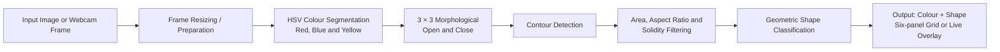
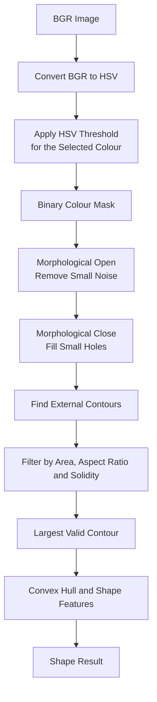
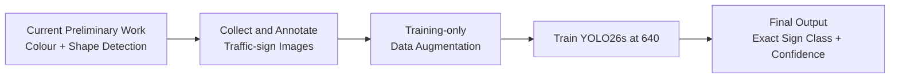

# Chapter 3 — Preliminary Proposed Method and System Design

> **Preliminary-stage scope.** The OpenCV-only results and limitations remain unchanged. The approved next-phase detector is YOLO26s at a 640-pixel baseline.

## 3.1 Design Specification

### 3.1.1 Preliminary System Scope

The preliminary MYSignVoice system demonstrates traffic-sign candidate detection using traditional OpenCV image processing. It accepts a static traffic-sign image or a live webcam frame, isolates likely red, blue and yellow sign regions, removes small mask noise, extracts contours, and classifies the dominant sign shape as Circle, Triangle, Rectangle, Octagon or Polygon.

The current preliminary implementation does **not** identify the exact traffic-sign meaning or pictogram. For example, it can recognise that an object is a red circle, but it cannot distinguish a speed-limit 30 sign from a speed-limit 60 sign. Deep-learning recognition using YOLO26s is the approved next phase after the preliminary work.

### 3.1.2 Methodology and Work Procedure

The preliminary work follows this procedure:

1. Capture a road-sign image from the supplied dataset or webcam.
2. Resize the static image to 300 × 300 pixels for consistent output. Live camera frames are resized to 640 × 480 pixels.
3. Convert the BGR image to HSV colour space.
4. Apply red, blue or yellow HSV thresholds to create a binary colour mask.
5. Apply 3 × 3 morphological opening to remove small noise and morphological closing to fill small holes.
6. Find external contours from the cleaned mask.
7. Reject non-sign-like contours using area, aspect ratio and solidity filters.
8. Extract geometric features from the largest valid contour: convex hull, polygon vertices, bounding-box extent and minimum-enclosing-circle area ratio.
9. Classify the shape and show the result as a six-panel static grid or a live camera overlay.
10. Record the results and analyse incorrect cases for future improvement.

### 3.1.3 Tools and Technologies

| Area | Tool / technology | Purpose |
|---|---|---|
| Image processing | OpenCV 4 with C++17 | HSV colour segmentation, morphology, contour extraction and shape classification |
| Static testing | `shape_detection.cpp` | Processes the 84 supplied images and saves six-panel output grids |
| Live demonstration | `camera_detection.cpp` | Detects sign colour and shape from a webcam stream |
| Development environment | Microsoft Visual Studio 2022 | Build and run the C++ OpenCV program on Windows |
| Test images | Red, Blue and Yellow Signs folders | Evaluate segmentation and geometric shape classification |

### 3.1.4 User Requirements

For the preliminary prototype, the system shall:

- accept a traffic-sign image or webcam frame;
- segment red, blue and yellow sign-coloured regions;
- reduce small mask noise before contour extraction;
- classify a valid dominant contour as Circle, Triangle, Rectangle, Octagon or Polygon;
- show intermediate processing results so that the method is understandable;
- display a stable live colour-and-shape label after the same result appears for three frames;
- save static output images for report evidence.

### 3.1.5 Preliminary Performance Definition

The preliminary performance measure is **geometric shape-classification accuracy**, not final traffic-sign recognition accuracy.

```text
Shape-classification accuracy =
(Correct shape classifications / Total test images) × 100%
```

The prototype was tested on 84 supplied images: 28 red, 28 blue and 28 yellow signs. It correctly classified 78 images, giving a measured shape-classification accuracy of **92.9%**. This result evaluates only the broad geometric shape; it does not confirm the detailed sign category or pictogram.

### 3.1.6 Verification Plan

| Test | Method | Evidence / expected result |
|---|---|---|
| Static segmentation test | Run `shape_detection.cpp` on all 84 images | Saved six-panel grids and a result table |
| Shape classification test | Compare each predicted shape with the visible sign shape | 78/84 correct; 92.9% preliminary accuracy |
| Colour-mask inspection | Inspect red, blue and yellow mask panels | Sign region is mostly isolated from background |
| Live camera test | Present coloured signs to `camera_detection.cpp` | Stable colour-and-shape label after three frames |
| Error analysis | Inspect six incorrect output grids | Explain effects of pixelation, glare and similar-colour backgrounds |

## 3.2 System Design and Overview

### 3.2.1 Preliminary System Block Diagram



The system first prepares the image, then uses HSV colour segmentation to isolate sign-coloured pixels. Morphological processing cleans the binary mask. The remaining contours are filtered to remove small or elongated background regions. The largest valid contour is classified geometrically, and the result is displayed to the user.

### 3.2.2 Description of Each Block

| Block | Input | Processing | Output |
|---|---|---|---|
| Input image or webcam frame | Static test image / live camera frame | Reads the traffic scene | BGR image frame |
| Frame preparation | BGR frame | Static mode: resize to 300 × 300. Camera mode: resize to 640 × 480 and apply limited white-balance correction. | Prepared frame |
| HSV colour segmentation | Prepared frame | Converts BGR to HSV; applies dedicated red, blue or yellow thresholds. | Binary colour mask |
| 3 × 3 morphological open and close | Binary mask | Open removes small isolated white pixels; close fills small black gaps inside sign regions. | Cleaned mask |
| Contour detection | Cleaned mask | Finds external connected boundaries. | Candidate contours |
| Geometric filtering | Candidate contours | Checks minimum area, aspect ratio and solidity; selects the largest valid contour. | Sign-like contour |
| Shape classification | Sign-like contour | Uses convex hull, loose/strict polygon vertices, circle-fill ratio and extent. | Circle, Triangle, Rectangle, Octagon or Polygon |
| Result display | Classification result | Creates six-panel static result or camera overlay. | Visual preliminary result |

### 3.2.3 Image-Processing Detail Block Diagram



For static images, grayscale conversion, Gaussian blur and Canny edge detection are also shown in the output grid. They are included for visual explanation only. The actual contour used for classification is obtained from the cleaned HSV colour mask.

### 3.2.4 Static and Live Demonstration Outputs

**Static mode — `shape_detection.cpp --show`:** The program displays and saves a six-panel grid: Original, Grayscale, Canny Edges, Colour Mask, Shape and Sign Segmented. The user presses a key to continue to the next image.

**Live mode — `camera_detection.cpp`:** The program processes red, blue and yellow masks in each webcam frame. It applies limited gray-world white balance, requires an area above 3000 px² and displays a label only when the same colour and shape remain stable for three frames. Press **M** to show the mask/contour split view and **Q** or **Esc** to exit.

### 3.2.5 Approved Next Phase: YOLO26s Recognition

The final system will extend this preliminary pipeline with YOLO26s. After collecting and annotating images for the target Malaysian sign classes, YOLO26s will detect sign bounding boxes and recognise the exact pictogram/class. This step is necessary because the preliminary method can recognise only colour and shape, not the detailed sign meaning.



## 3.3 Implementation Issues and Challenges

| Issue / challenge | Observed effect in preliminary work | Current handling | Future improvement |
|---|---|---|---|
| Similar-colour background | Sky, vegetation or red objects can merge with the sign mask | HSV saturation/value thresholds; aspect ratio and solidity filtering | Adaptive thresholds and connected-component separation |
| Pixelation and blurred boundaries | Round signs may become Polygon or Octagon | Morphological cleaning and contour smoothing | Higher-quality images, controlled smoothing and additional circle checks |
| Glare and low illumination | Blue sign masks can become incomplete | Limited camera white balance; HSV thresholds | Adaptive illumination correction and more varied training data |
| Yellow-background interference | Yellow/green vegetation can attach to a triangle mask | Lower yellow solidity threshold | Colour refinement and a triangle-angle/minAreaRect validation step |
| Perspective and multiple signs | Largest-contour selection may not represent all signs | Geometric filters select one dominant candidate | YOLO26s multi-object detection in the next phase |
| Exact sign recognition | Colour/shape cannot distinguish signs with the same geometry | Clearly restrict prototype claims to shape detection | Train a labelled YOLO26s model |

The preliminary implementation demonstrates that classical image processing can detect sign candidates effectively, but its sensitivity to real-world lighting and background conditions explains why the YOLO26s CNN is required for the final system.
